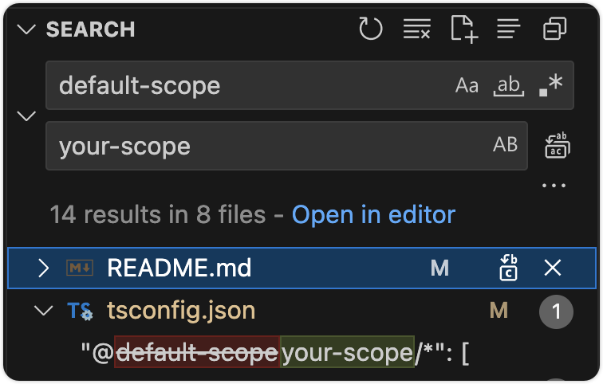

<h1 align="center">ts-monorepo-template</h1>

<p align="center">
  A hassle-free TypeScript monorepo template
</p>

<!-- START doctoc generated TOC please keep comment here to allow auto update -->
<!-- DON'T EDIT THIS SECTION, INSTEAD RE-RUN doctoc TO UPDATE -->

## Table of Contents

- [Table of Contents](#table-of-contents)
- [Quick Start](#quick-start)
- [Concepts](#concepts)
  - [Integrations](#integrations)
  - [Go to definition](#go-to-definition)
  - [Lock Dependency Version](#lock-dependency-version)
- [Quick Start](#quick-start-1)
  - [Install Dependencies](#install-dependencies)
- [Prior Arts](#prior-arts)
- [LICENSE](#license)

<!-- END doctoc generated TOC please keep comment here to allow auto update -->

## Quick Start

1. Click "Use this template" at this repository.
2. Rename all `@ulivz/` to your npm package scope (e.g. `@foo`):

<p align="center">
  
</p>

## Concepts

### Integrations

|                 |                                                                                               |
| --------------- | --------------------------------------------------------------------------------------------- |
| Package Manager | [pnpm](https://pnpm.io/)                                                                      |
| Linter          | [eslint](https://pnpm.io/)                                                                    |
| Lint Preset     | [eslint-config-typescript-library](https://github.com/ulivz/eslint-config-typescript-library) |

### Go to definition

See: [How to set up a TypeScript monorepo and make Go to definition work](https://medium.com/@NiGhTTraX/how-to-set-up-a-typescript-monorepo-with-lerna-c6acda7d4559).

### Lock Dependency Version

## Quick Start

### Install Dependencies

```bash
npm run bootstrap
```

## Prior Arts

- [ts-monorepo](https://github.com/NiGhTTraX/ts-monorepo)

## LICENSE

MIT License © [ULIVZ](https://github.com/ulivz)
